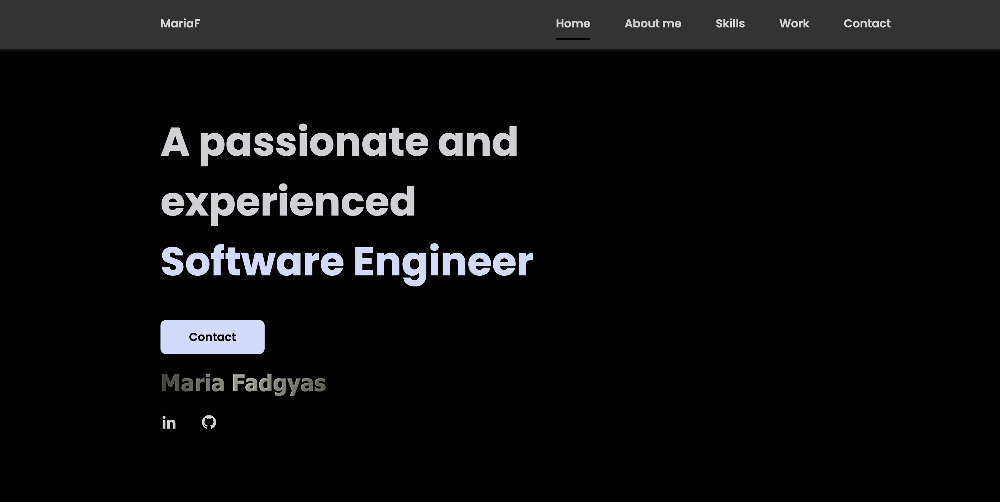

# Responsive Portfolio 

## Welcome to My Portfolio

Hello! I'm Maria, a passionate and experienced Software Engineer. I specialize in developing robust, scalable, and efficient software solutions. My goal is to leverage cutting-edge technologies to solve complex problems and deliver high-quality software that drives innovation and business success.

## Explore My Work
In this portfolio, you'll find a selection of my projects that demonstrate my expertise in software engineering. Each project highlights my ability to design, develop, and deploy software across different platforms.

## Let's Connect
I am always eager to take on new challenges and collaborate with forward-thinking individuals and organizations. Whether you have a project in mind, a problem to solve, or just want to chat about technology, feel free to get in touch.
Reach out to discuss potential collaborations, opportunities, or just to connect and share ideas.

## Responsive Portfolio

- Responsive Personal Portfolio Website based on the template offered by https://github.com/bedimcode/portfolio-responsive-complete?tab=readme-ov-file
- Images were generated with 

